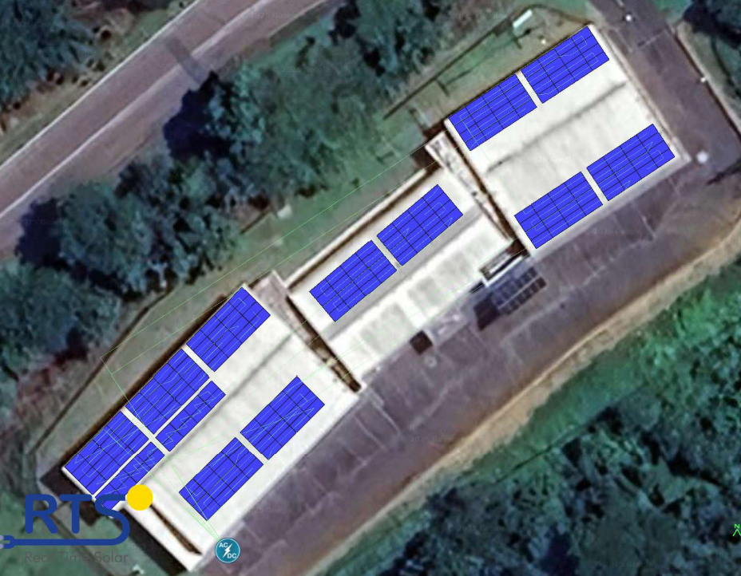
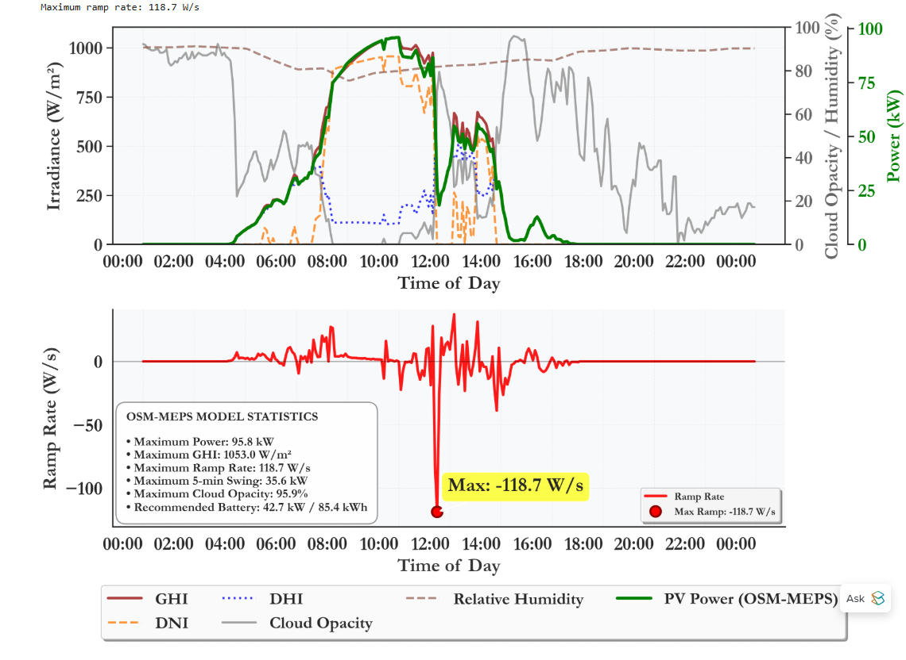
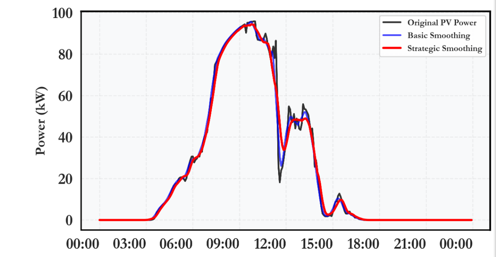

# Energy Assessment of Rooftop Solar PV and Ramp Rate Mitigation Using the OSM-MEPS Model in Westville-Durban, South Africa
This project simulates PV smoothing and battery operation.

## System Overview

