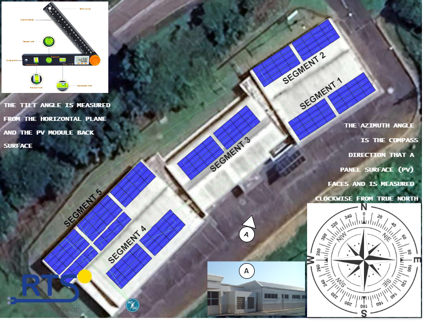
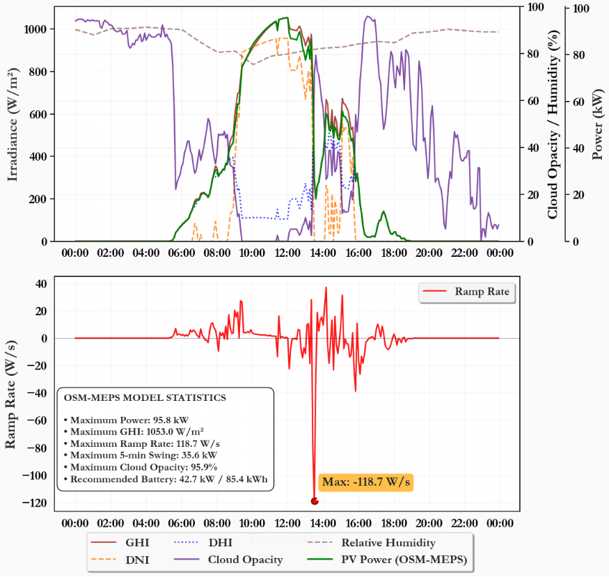
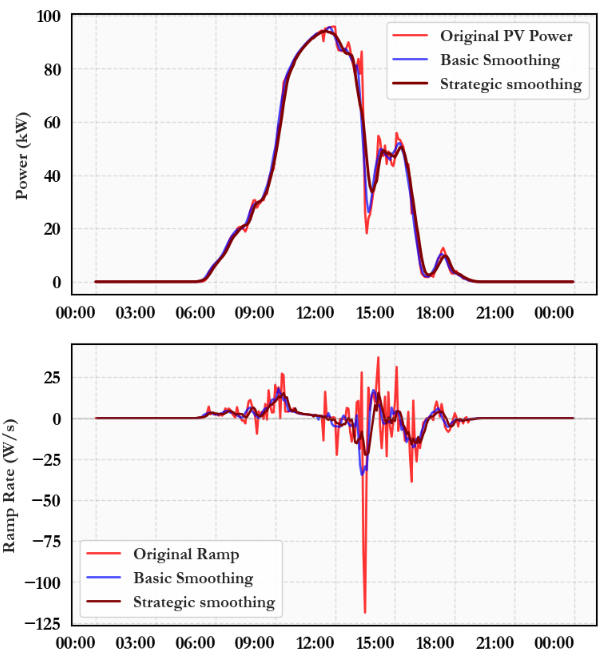

# Energy Assessment of Rooftop Solar PV and Ramp Rate Mitigation Using the OSM-MEPS Model in Westville-Durban, South Africa

## 🕒 NB: Ensure Manual Time Zone Conversion of Solcast DNV data (SAST = UTC + 2 Hours)

## === LOAD WEATHER DATA - SHIFT CSV TIME BY +2 HOURS ===
file_path = 'csv_-29.815268_30.946439_fixed_23_0_PT5M.csv'

## Read CSV and parse datetime
df = pd.read_csv(file_path)
df['period_end'] = pd.to_datetime(df['period_end'])  # Original timezone
df.set_index('period_end', inplace=True)

## Apply manual timezone shift (SAST = UTC +2)
df.index = df.index + pd.Timedelta(hours=2)

## Optional: filter desired date range
df = df[(df.index >= '2024-01-01') & (df.index < '2025-01-01')]

## System Overview

# Feasible Rooftop PV Field Segments

| Segment | Tilt (°) | Azimuth (°) | No. of Modules |
|---------|-----------|-------------|----------------|
| 1       | 5.6       | 319.88      | 32             |
| 2       | 2.8       | 146.61      | 32             |
| 3       | 5.0       | 326.42      | 32             |
| 4       | 3.0       | 315.21      | 32             |
| 5       | 3.0       | 134.65      | 64             |

# Summary of Annual and Hourly Statistical Comparison Among PV Models

| Model | Annual (kWh) | Mean (kWh/h) | SD (kWh/h) |
|-------|-------------|-------------|------------|
| PVLIB | 149,465 | 17.060 | 24.582 |
| OSM-MEPS | 147,892 | 16.881 | 25.048 |
| PVWatts | 147,970 | 16.890 | 24.336 |
| Aurora (2021) | 161,936 | 18.535 | 6.131 |

*ANOVA (Hourly):* F = 12.0099, p = 7.45×10⁻⁸ (significant)  
*Tukey HSD:* Aurora differs from others (p < 0.05)

# System Configuration
- **Total panels:** 192  
- **Panel power:** 600 W each  
- **Total DC capacity:** 115.2 kW  

## Annual Energy Results
- **PVLIB:** 155,724 kWh  
- **OSM-MEPS:** 147,892 kWh  
- **PVWatts:** 154,167 kWh  
- **Aurora (2021):** 162,646 kWh

## Power Characteristics
- **Max Power:** 95.8 kW  
- **Min Power:** 0.0 kW  
- **Power Range:** 95.8 kW  

## Ramp Analysis
- **Max Ramp Rate:** 118.7 W/s at 2024-01-12 11:30:00+00:00  
- **Max 5-min Power Change:** 35.6 kW  

## Meteorological Conditions
- **Max GHI:** 1053.0 W/m²  
- **Max Cloud Opacity:** 95.9%  
- **Max Humidity:** 91.2%  

## Battery Sizing (OSM-MEPS)
- **Power Rating:** 42.7 kW  
- **Energy Capacity:** 85.4 kWh  
- **Can handle:** 120.0% of worst-case swing (+20.0% margin)  

# Max Ramp Event Analysis
**Event at 2024-01-12 11:30:00+00:00**
- **Power:** 61.8 → 26.3 kW (Δ: -35.6 kW)  
- **GHI:** 758.0 → 290.0 W/m²  
- **Cloud:** 23.6% → 70.6%  
- **Calculated Ramp:** -118.7 W/s  

# Smoothing Algorithm

**Detected daily pattern:**
- Peak: 95.8 kW at 2024-01-12 09:55:00+00:00
- Sunrise: 2024-01-12 05:00:00+00:00
- Sunset: 2024-01-12 15:30:00+00:00

## Performance Comparison

**Original System:**
- Max Ramp: 118.7 W/s
- Power Range: 95.8 kW

**Basic Smoothing:**
- Max Ramp: 34.6 W/s
- Ramp Reduction: 70.8%

**Bell Curve Smoothing:**
- Max Ramp: 22.3 W/s
- Ramp Reduction: 81.2%
- Peak Preservation: -1.2% vs basic

**Battery Usage:**
- Max Charge (Bell): 28.2 kW
- Max Discharge (Bell): 22.6 kW
- Battery Utilization: 66.0%

## Bell Curve Preservation Analysis

**Peak Time Alignment:**
- Original: 2024-01-12 09:55:00+00:00
- Smoothing/Bell Curve: 2024-01-12 09:45:00+00:00
- Basic: 2024-01-12 09:45:00+00:00

**Morning-Afternoon Symmetry:**
- Original: 3.997
- Bell Curve: 4.018
- Closer to 1.0 = better symmetry preservation

